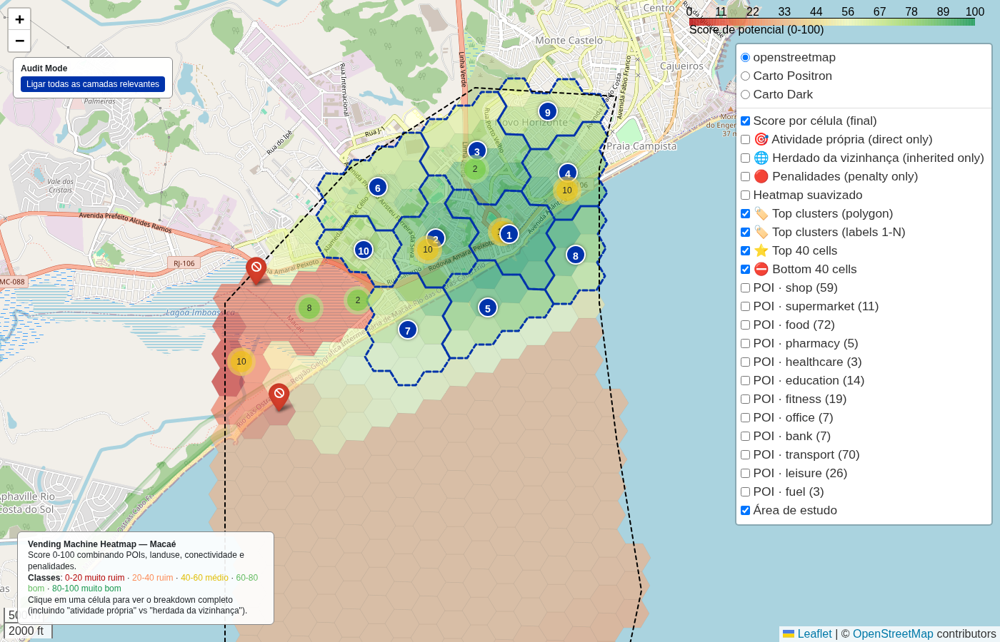

# Visão geral da cidade (recorte completo)

- **lat / lon / zoom**: -22.41200, -41.79700, z=14

## O que deveria ser visto
Polígono inteiro visível com gradiente do vermelho (SW) ao verde (NE). Top clusters numerados 1-10 sobre as áreas verdes. Costa hugged pela borda.

## Verdict (TP/FP/TN/FN — preencher após inspeção visual)
_TP global: gradiente coerente com a geografia urbana de Macaé sul._
