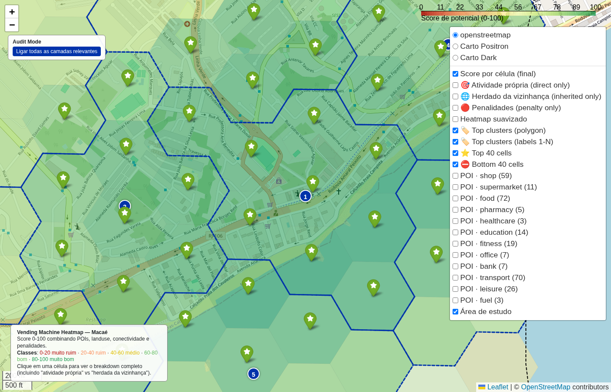

# Top cluster #1 — Glória

- **lat / lon / zoom**: -22.40233, -41.79583, z=16

## O que deveria ser visto
Cluster #1 (9 células, raio ~699m, score médio 99). Sinais: proximidade a âncoras + alimentação + diversidade de usos. Esperado: ruas com comércio ativo visíveis sob o overlay verde, label '1' centrado no cluster.

## Verdict (TP/FP/TN/FN — preencher após inspeção visual)
_TP esperado: área comercial real. Verificar se a cor verde coincide com o tecido urbano denso visível no basemap._
