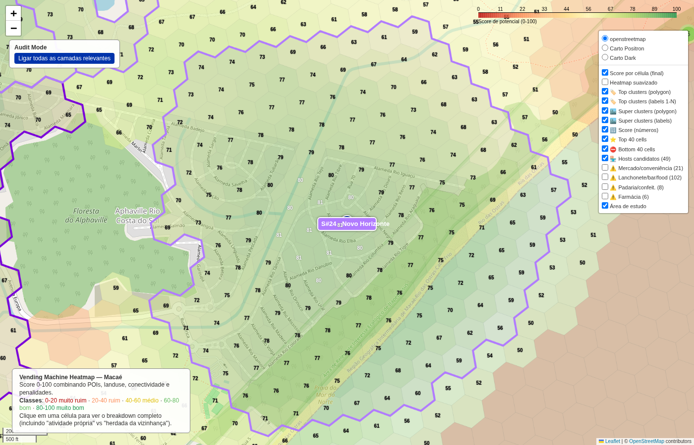

# Top cluster #2 — Novo Horizonte

- **lat / lon / zoom**: -22.43244, -41.84499, z=16

## O que deveria ser visto
Cluster #2 (158 células, raio ~951m, score médio 73). Sinais: densidade residencial + conectividade viária + proximidade a âncoras. Esperado: ruas com comércio ativo visíveis sob o overlay verde, label '2' centrado no cluster.

## Verdict (TP/FP/TN/FN — preencher após inspeção visual)
_TP esperado: área comercial real. Verificar se a cor verde coincide com o tecido urbano denso visível no basemap._
