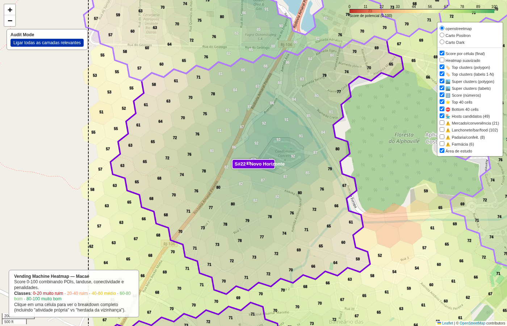

# Top cluster #3 — Novo Horizonte

- **lat / lon / zoom**: -22.43353, -41.86521, z=16

## O que deveria ser visto
Cluster #3 (111 células, raio ~1030m, score médio 76). Sinais: proximidade a âncoras + densidade residencial + conectividade viária. Esperado: ruas com comércio ativo visíveis sob o overlay verde, label '3' centrado no cluster.

## Verdict (TP/FP/TN/FN — preencher após inspeção visual)
_TP esperado: área comercial real. Verificar se a cor verde coincide com o tecido urbano denso visível no basemap._
