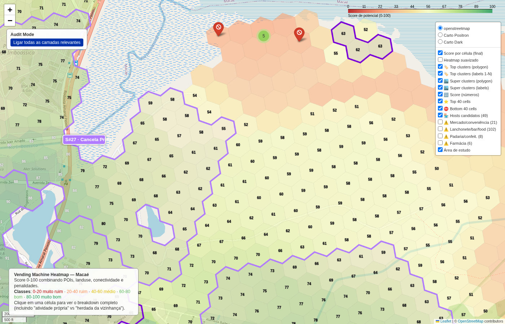

# Faixa média (40-60) — transição

- **lat / lon / zoom**: -22.41981, -41.84984, z=16

## O que deveria ser visto
Célula score 60 (classe médio); direct=30 inherited=30. Esperado: cor amarela/clara com basemap mostrando residencial moderado, alguma rua arterial, sem aglomeração comercial densa.

## Verdict (TP/FP/TN/FN — preencher após inspeção visual)
_TP se for residencial com pouco comércio; FP se for área obviamente sem nada (mato/lote vazio)._
