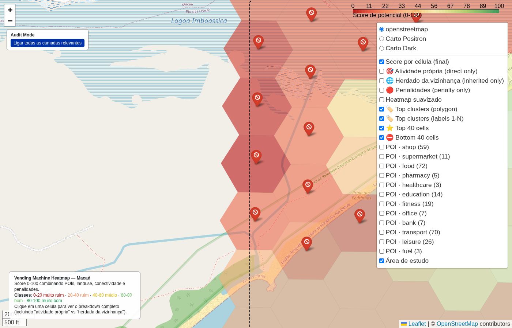

# Área classificada ruim

- **lat / lon / zoom**: -22.41880, -41.82963, z=16

## O que deveria ser visto
Célula score 0.1, raw_unsuitable_frac=0.00. Esperado: cor vermelha sob basemap mostrando área de baixíssima atividade (periferia, lote vazio, ou landuse natural).

## Verdict (TP/FP/TN/FN — preencher após inspeção visual)
_TN se for visivelmente área inviável; FN se houver comércio que o OSM simplesmente não mapeou._
