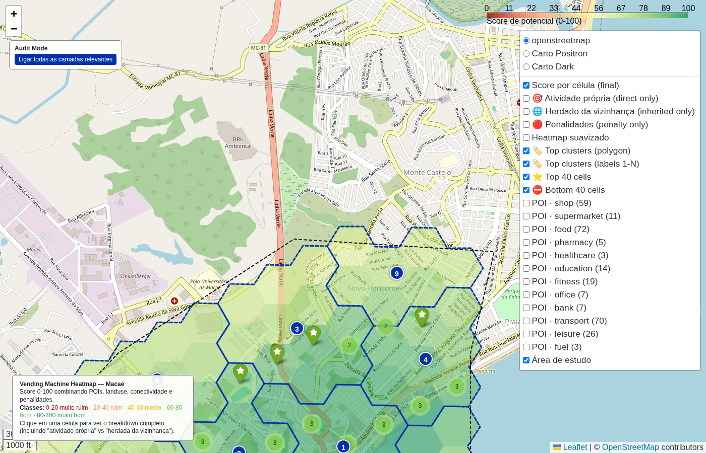

# Borda norte do polígono (perto da Ponte da Barra)

- **lat / lon / zoom**: -22.38500, -41.79500, z=15

## O que deveria ser visto
A linha tracejada preta do polígono visível atravessando o mapa. Acima dela = fora do recorte (não analisado). Abaixo = células coloridas. Esperado: corte limpo no rio/centro.

## Verdict (TP/FP/TN/FN — preencher após inspeção visual)
_TP: validar que o recorte não foi 'contaminado' por células do outro lado da Ponte da Barra ou área do aeroporto._
