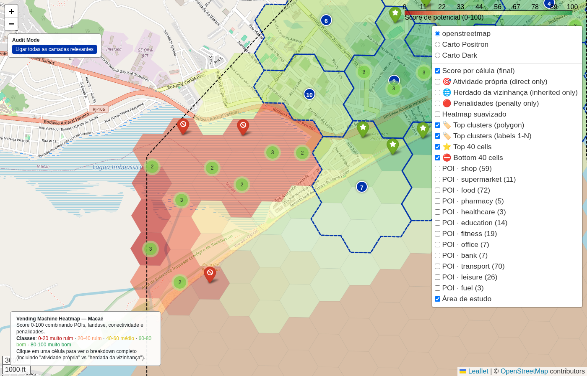

# Transição forte verde→vermelho (oeste-leste)

- **lat / lon / zoom**: -22.41300, -41.81500, z=15

## O que deveria ser visto
Lateral oeste em vermelho (Virgem Santa / borda), lateral leste em amarelo/verde (chegando em Bosque Azul / Glória). Gradiente claro.

## Verdict (TP/FP/TN/FN — preencher após inspeção visual)
_TP: a transição deve coincidir com mudança real no tecido urbano (rua/avenida arterial separando densidades)._
